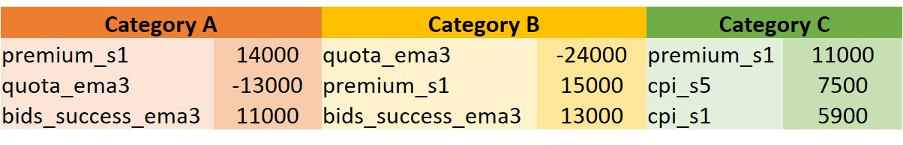
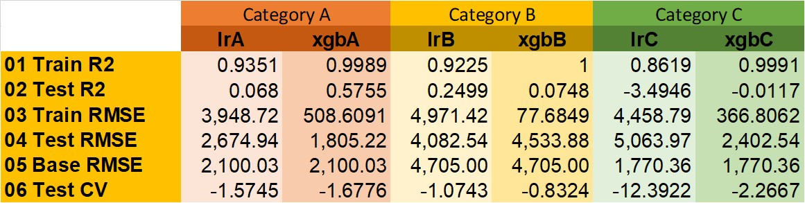

---
## Problem statement

With more retailers and shoppers moving online, there is an increased demand for delivery services. <br>
More corporations are looking to expand their private hire and delivery fleet. This is a pilot project to <br>
investigate prediction of the COE premium for budgetary purposes. With a good prediction, stakeholders <br> 
would be able to better plan and allocate budgets. 

Would classic time series or regression models be able to achieve this with a RMSE of 5K or less?

---
## Executive Summary

All vehicles in Singapore require a COE. To register a vehicle, you must first place a bid for a Certificate of Entitlement (COE) in the corresponding vehicle category. A successful COE bid gives you the right to own a vehicle that can be used on the road for 10 years.
COEs are released through open bidding exercises. At the end of the 10-year COE period, you can choose to deregister your vehicle, or renew your COE.


We began this project with 46 files and that quickly got reduced to 6 files which eventually left us with less than 10 features. 
Some challenges on working with real world data on top of the usual data cleaning are:
- Finding data that are available within the same time frame, for example time frame of interest is between 2010 to 2020, datasets available may be from 2018 to 2020, or 2000 to 2012.
- Finding data that are in the same granularity, for example when most datasets are in monthly, how to fit daily or weekly data together 
- Finding data that are categorized/grouped/labeled for your problem, for example COE categories vs CC vs Make vs passenger capacity. 

With limited features available, the first model we tried was Classic Time Series model ARIMA. Although the target, premium was not stationary we have taken premium's diff order 1 for ARIMA and GridSearched resulting with an order of (1,0,2). However ARIMA did not yield a very good predict.

Since the time series models are out, next step was to look into feature engineering to increase the number of features for the other models that we are going to try. In feature engineering, there are two main groups that we created are shifted and EWMA features.
- Shifted features, these are the features where values in the past have an impact to our target. Features that are shifted were ['cpi', 'fuel_price', 'dereg', 'premium'], and these are shifted by [1, 2, 3, 5, 10, 15, 20, 24, 48]. 
- EWMA Features, exponentially weighted moving average is a moving average where higher weights are given to the values that are nearer. Features that are EWMA are ['quota', 'bids_success', 'bids_received'] and they are applied on EWMA 3.

Now that we have more features, ~45 features. We will use linear regression to analyze the features that has impact on the target. From the initial linear regression we were hitting RMSE of ~12K, after regularization and iterations of tuning. We were able to achieve RMSE for ~8K. 

Below is the top 3 features for each category from our Linear regression:

The top 3 features, premium_s1, quota_ema3 and bids_success_ema3 are consistent for both Category A and B. For Category C, quota_ema3 and bids_success_ema3 are on the 4th and 5th position which has significant impact on the target as well.

Next we moved on to XGBoost Regressor to see if we can improve the RMSE further. While tuning the XGBoost Regressor we realised that using a single model and a single set was not helping. Hence we created models for each category along with it's own set of features. After many iterations of hyperparameters tuning and features selection for each model, we were able to achieve RMSE ~5K. 
<br>
The final model metrics are as shown below:


prefix **lr** are Linear Regression model, the last character indicates the COE category<br>
prefix **xgb** are XGBoost Regressor model, the last character indicates the COE category

Although we have achieved a RMSE of < 5K, these models are far from perfect.
In this project we have only scratch the surface of putting together a model to predict the COE premium.
There are many more factors that affects COE prices. As with all corporate projects it is always a balance of Scope, Time and Cost. Projects have to be scoped in a way that it meets the business requirements, delivered on time and within cost.

---
### Limitations of the models
Limitations of the models:
- Limited data time frame, for this project the time frame we were looking at is from 2010 to 2020. While we were able to achieve a reasonable good RMSE, COEs have a lifespan of 10 years this 10 year cycle would not be picked up by the models. For that to happen, we should have data to contain at least a few cycles. This should help in the case of the ARIMA models as well.
- Limited data, without feature engineering we had only a handful of features. It will be good to collect more data and include more features for the analysis. 
- Take events into account, for example Covid and Financial Crisis

---
## Recommendations
Some recommendations to further improve the models:
- Get more data 
    - in terms of time frame, should get data that captures at least 3 to 4 cycles. For this case COE started in 1990 so should get the full data if possible.
    - in terms of features, household income and unemployment rate
- Encoding events into features
    - MAS loan restrictions (When tighten or ease loan restrictions)
    - LTA annouce growth rate changes (LTA increase/decrease growth)
    - Car launches/events (Major car launches or event, where discount and incentives entices buyers)
    - Vehicular Emissions Scheme
- With more data we can also try Auto ARIMA
- Sentiment of owning a car


---
### Files used in this projects
```bash
|-- README.md
|-- Predicting COE.pdf
|-- code
|   |-- capstone_predict_coe.ipynb
|   |-- capstone
|       |-- GatherData
|           |-- DownloadFiles.py
|       |-- Model
|           |-- DeployModel.py
|       |-- Utils
|           |-- Utils.py
|-- data
|   |-- cpi_sgp.csv
|   |-- file_manifest_pipe.csv
|   |-- finalized_model.pkl
|   |-- fuel_price.csv
|-- images
|   |-- COEcat.png
|   |-- metrics.jpg
|   |-- top_features.jpg

```
---
