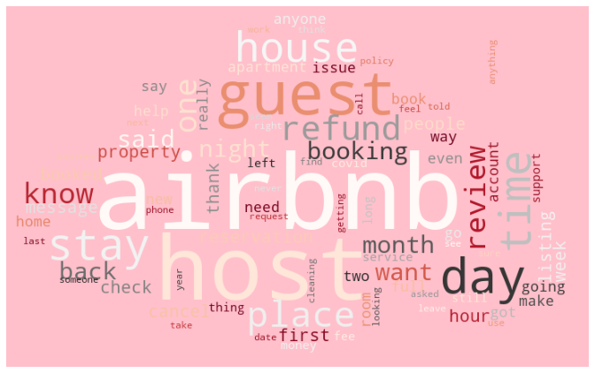
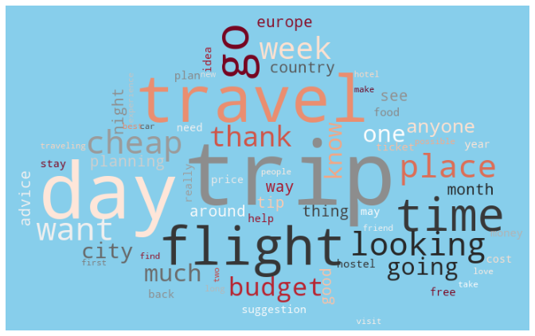
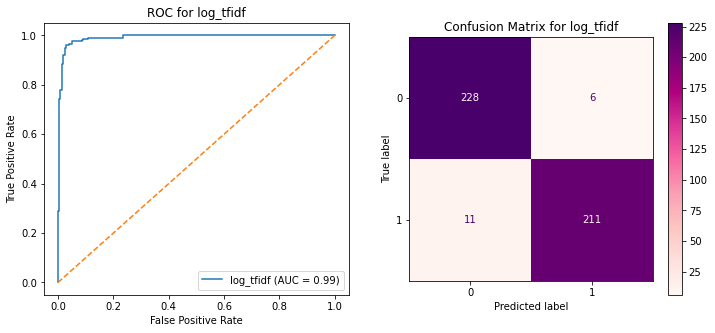

# Project 3: Reddit AirBnb vs ShoeString

## Executive Summary
---

Airbnb is one of the world’s largest marketplaces for unique, authentic places to stay and things to do, offering over 7 million accommodations and 50,000 handcrafted activities, all powered by local hosts. An economic empowerment engine, Airbnb has helped millions of hospitality entrepreneurs monetize their spaces and their passions while keeping the financial benefits of tourism in their own communities.

To be able to differentiate itself from the competitors, it has to constantly review and monitor the messaging that is being communicated corporately, as well as the messaging that is used in the social media. In this notebook, we will be looking at the posts on Reddit, which a network of communities based on people's interests. <br>
Specifically we will be looking at these 2 subreddits:
- r/AirBnB
- r/ShoeString (Travel on a Shoestring Budget)

This is the pilot project into analyzing Posts in reddit, and the main objective is to gauge if AirBnB is being perceived as being a purely budget lodging option. We will be training classification models Logistic Regression and MultinormialNB to determine which subreddit a post is from. The high False Negatives and False Positives rate would potentially mean that there is no clear distinction between AirBnB and ShoeString. We are looking at selecting the model with a minimum of 95% accuracy.


### Visualizing the data into wordclouds




In this project we will be looking to pair these Vectorizers; Count Vectorizer, Hashing Vectorizer
and Tfidf Vectorizer with LogisticRegresion, BernoulliNB and MultinomialNB. After analysis, the 2 best performing pairing was Hashing Vectorizer with MultinomialNB and Tfidf Vectorizer with LogisticRegression. Between these 2 pairs, the final selection is Tfidf Vectorizer with LogisticRegression, as:
- It is slightly better in terms of overfitting
- It has similar scores with lesser features when compared to MultinomialNB
- False negatives and False positives rates are pretty close as well. 

Although we have added AirBnB into the stop word list we were still able to achieve a test score of 96.27%. Thus we are happy with the results and will continue to leave the word in the stop word list.

|   | MultinomialNB_hash | LogisticRegression_tfidf |
|:--| --:      | --:       |
| Train score | 0.989 | 0.9868 |
| Test score | 0.9627 | 0.9627 |
| Score diff | 0.0263 | 0.0241 |
| No. of features | 131072 | 1000 |
| Precision | 0.968 | 0.9724 |
| Specificity | 0.9701 | 0.9744 |
| Sensitivity | 0.955 | 0.9505 |
| True Negatives | 227 | 228 |
| False Positives | 7 | 6 |
| False Negatives | 10 | 11 |
| True Positives | 212 | 211 |

<br>
The false positives, posts that are classified as AirBnB but were actually ShoeString posts. <br>
The false negatives, posts that are classified as ShoeString but were actually AirBnB posts. <br>
There are 22 false negatives and 13 false positives out of 1824 posts, 98% of the posts were classified correctly. <br> Looking at these misclassifications, most of them were general comment/enquiry type of posts so they are still within expectation of 95% accuracy.

---

Below are the AUC and Confusion matrix for the test data on Tfidf Vectorizer and LogisticRegression


---


---
### Files used in this projects
```bash
|-- README.md
|-- AirBnB.pdf
|-- code
|   |-- project3_Reddit.ipynb
|-- data
|   |-- airbnb.csv
|   |-- shoestring.csv
|-- image
|   |-- cloud.jpg
|   |-- roc.png
|   |-- airbnb.png
|   |-- shoestring.png
```
---


